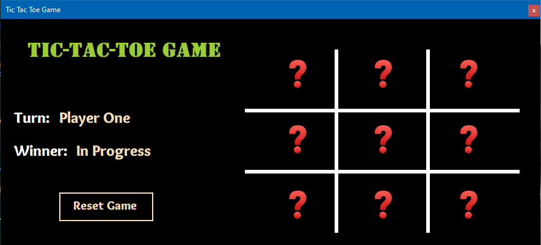
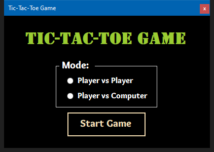
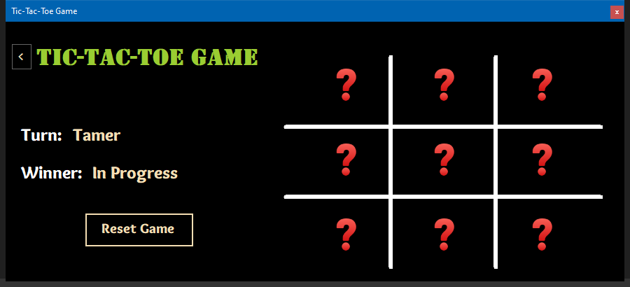

# Tic-Tac-Toe Game (C# WinForms)

- Language: C#
- Framework: .NET Framework 4.8
- Type: Windows Forms
- Description: Classic Tic Tac Toe game with UI

A classic **Tic-Tac-Toe game** built with **C#** and **Windows Forms (.NET Framework)**.  
This game supports **Player vs Player (PvP)** and **Player vs Computer (PvC)** modes with a simple, interactive GUI.

* * *

## 🎮 Features

-   **Two Game Modes:**
    
    -   Player vs Player (PvP)
        
    -   Player vs Computer (PvC) using simple random move selection (not AI-based)
        
-   **Dynamic Form Layout:** Automatically resizes for different game modes  
    
-   **Customizable Player Names** and character choice (**X** or **O**)
    
-   **Interactive GUI:** Clickable cells with instant feedback
    
-   **Win Detection:** Highlights the winning combination
    
-   **Draw Detection:** Recognizes tied games
    
-   **Reset & Replay:** Restart the game at any time
    
-   **Back to Menu:** Return to main menu without restarting the app
    

* * *

## 📸 Screenshots

### Initial Version

### Version 1.0
| Main Menu | Gameplay |
| --- | --- |
|  |  |

* * *

## 💻 Installation

1.  Clone the repository:
    
    git clone `https://github.com/muhammad-tamer-mte/TicTacToe-WinForms-CSharp.git`
    
2.  Open the solution file (.sln) in **Visual Studio**.
    
3.  Build and run the project.
    

* * *

## ⚙️ Project Structure

TicTacToe-WinForms-CSharp/ 

    ├── README.md
    ├── App.config
    ├── frmGame.cs
    ├── frmGame.Designer.cs
    ├── frmGame.resx
    ├── frmStart.cs
    ├── frmStart.Designer.cs
    ├── frmStart.resx
    ├── Program.cs
    ├── Tic-Tac-Toe Game.csproj
    ├── Tic-Tac-Toe Game.sln
    ├── Properties/
    │   ├── AssemblyInfo.cs
    │   ├── Resources.Designer.cs
    │   ├── Resources.resx
    │   ├── Settings.Designer.cs
    │   └── Settings.settings
    ├── Resources/
    ├── Screenshots/
    └── Videos/
        └── gameplay.wmv
		
**Notes:**  
- `frmGame.cs` and `frmStart.cs` are the main forms controlling the game logic and UI.  
- `Properties/` contains auto-generated files for project settings and resources.  
- `Resources/` include images, icons, or other assets that game uses.  
- `Screenshots/` images of the game.  
- `Videos/` contains gameplay videos.
* * *

## 📝 How to Play

1.  Open the game in Visual Studio or run the compiled executable.
    
2.  Choose a game mode (PvP or PvC).
    
3.  Enter player names and select a character (X or O).
    
4.  Click on a cell to place your mark.
    
5.  The game automatically checks for winners or draws.
    
6.  Use **Reset** to replay or **Back** to return to the menu.
    
## 📸 Video
[Watch the gameplay video](Videos/gameplay.mp4)

* * *

## 🚀 Future Improvements

-   Implement a smarter AI for PvC mode
    
-   Add animations and sound effects
    
-   Add multiple game themes

-   Track player scores across sessions
    

## 📄 License

This project is open-source and available under the **MIT License**.
